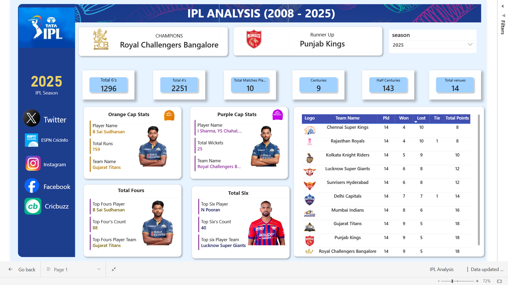

# 🏏 IPL Analysis Dashboard (2008 – 2025) | Power BI

## 📌 Overview
The **IPL Analysis Dashboard** is an interactive Power BI project designed to analyze Indian Premier League (IPL) data from **2008 to 2025**.  

This dashboard provides detailed season-wise insights where all visuals, statistics, player details, team standings, champions, and runner-up information dynamically update based on the selected IPL season.

The project demonstrates advanced Power BI concepts including:
- Data Modeling
- DAX Calculations
- Dynamic Filtering
- Interactive Visualizations
- KPI Reporting
- Sports Analytics Dashboard Design

---

# 🚀 Dashboard Features

## ✅ Dynamic Season Filter
- Select any IPL season from **2008 – 2025**
- Entire dashboard updates automatically based on selected season

---

## ✅ Champion & Runner-Up Analysis
Displays:
- IPL Champion Team
- Runner-Up Team
- Team Logos/Images

Data changes dynamically for every IPL season.

---

## ✅ KPI Cards
Interactive KPI cards showing:
- Total Sixes
- Total Fours
- Total Matches Played
- Total Centuries
- Total Half-Centuries
- Total Venues

All metrics update instantly according to selected season.

---

## ✅ Orange Cap & Purple Cap Analysis
Dynamic player statistics including:
- Player Image
- Player Name
- Team Name
- Runs/Wickets
- Team Information

Automatically updates for every season.

---

## ✅ Boundary Statistics
Displays:
- Top Four Hitter
- Top Six Hitter
- Boundary Counts
- Player Images
- Team Details

---

## ✅ Team Points Table
Interactive points table containing:
- Team Logos
- Matches Played
- Wins
- Losses
- Total Points
- Team Rankings

Updates dynamically based on selected IPL season.

---

# 📊 Dashboard Highlights
- Fully Interactive Dashboard
- Dynamic Image Rendering
- Season-wise Analytics
- Professional Dashboard Design
- Advanced DAX Measures
- Responsive Visual Layout

---

# 🛠️ Technologies Used
- Power BI
- DAX
- Power Query
- Data Modeling
- Excel / CSV Dataset

---

# 📈 Skills Demonstrated
- Data Visualization
- Dashboard Development
- Sports Data Analytics
- KPI Design
- DAX Calculations
- Interactive Reporting
- Data Transformation
- Dynamic Filtering

---

# 💡 Business Insights
This dashboard helps users:
- Analyze IPL season trends
- Compare team performances
- Identify top-performing players
- Track championship history
- Evaluate batting and bowling records
- Understand scoring patterns across seasons

---

# 🎯 Future Improvements
- Player vs Player Comparison
- Venue-wise Analysis
- Toss Impact Analysis
- Match Prediction Insights
- Mobile Responsive Layout
- Power BI Service Deployment

---

## IPL Dashboard Overview

### Additional Dashboard Screenshots

.png)

.png)

.png)

---

# ▶️ How to Use
1. Open the Power BI Dashboard
2. Select IPL Season using the slicer
3. Explore:
   - Champions & Runner-Up
   - Orange/Purple Cap Winners
   - Team Standings
   - KPI Statistics
   - Player Performance

---

# 👨‍💻 Author

## Parth Shah

### GitHub
https://github.com/Parthshah01

### LinkedIn
(Add your LinkedIn profile link here)

---

# ⭐ Project Outcome
Successfully developed a dynamic IPL analytics dashboard capable of providing detailed season-wise insights through interactive visual storytelling using Power BI.

---

# 📌 Project Status
✅ Completed
